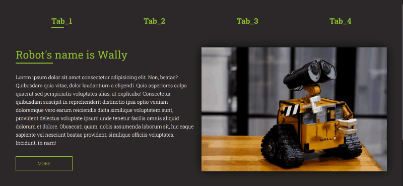
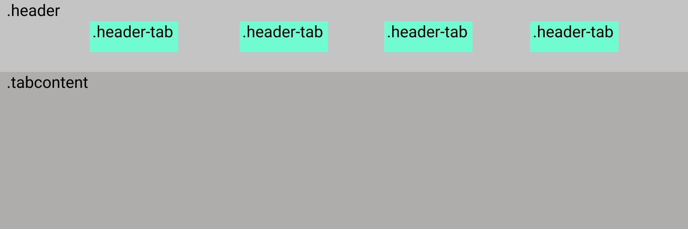

# Modal windows with Tabs

## On Native JavaScript with CSS



### Here is the start structure of HTML



### CSS classes look like this:

```css
.hide {
  display: none;
}
.show {
  display: flex;
}
```

### And the whole JS-code looks like this:

```javascript
window.addEventListener("DOMContentLoaded", function () {
  "use strict";

  let tab = document.querySelectorAll(".header-tab");
  let info = document.querySelector(".header");
  let tabContent = document.querySelectorAll(".tabcontent");

  function hideTabContent(tabNum) {
    for (let i = tabNum; i < tabContent.length; i++) {
      tabContent[i].classList.remove("show");
      tabContent[i].classList.add("hide");
    }
  }

  hideTabContent(1);

  function showTabContent(tabNumVisible) {
    if (tabContent[tabNumVisible].classList.contains("hide")) {
      tabContent[tabNumVisible].classList.remove("hide");
      tabContent[tabNumVisible].classList.add("show");
    }
  }

  info.addEventListener("click", function (event) {
    let target = event.target;
    if (target && target.classList.contains("header-tab")) {
      for (let i = 0; i < tab.length; i++) {
        if (target == tab[i]) {
          hideTabContent(0);
          showTabContent(i);
          break;
        }
      }
    }
  });
});
```

## Happy coding!
